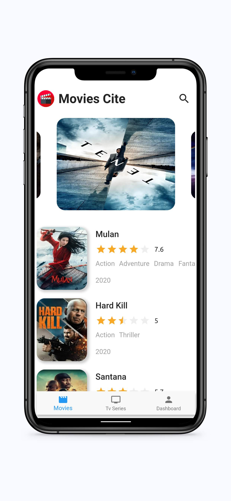

# Movies Cite

**Screenshot**

**Requirements**
- Location Access
- Internet connection
- Storage requirement < 30mb

**Highlights**
- Use [Tmdb] API
- Beautiful Ui across screens
- Cross Platform
- Info about latest movies/tv series
- Manual search option for actors, movies, cast, tv series

**Author**
   
<a href="https://github.com/vineetk242000" style="text-decoration:none">Vineet Kumar</a>
